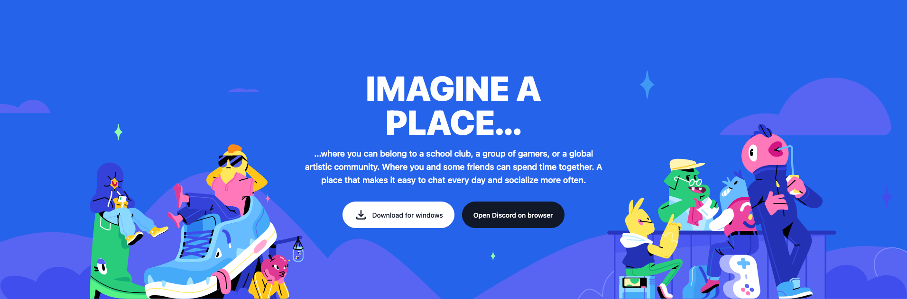
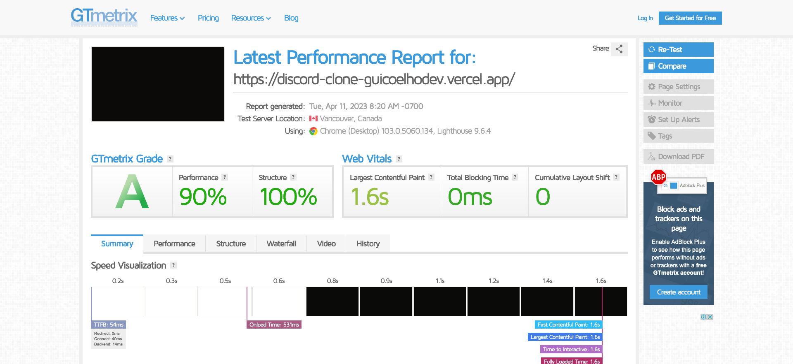
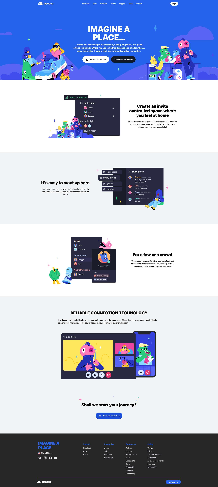
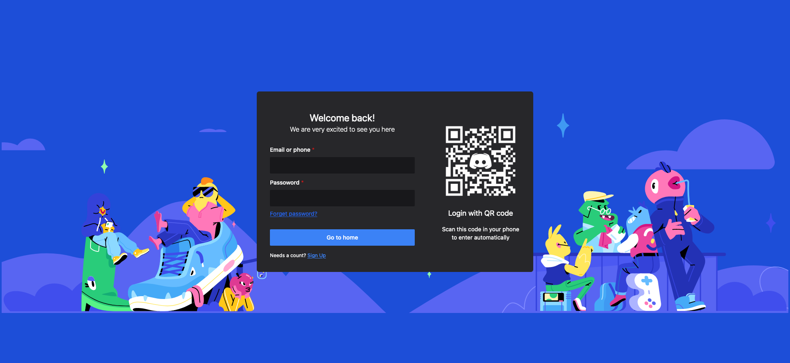
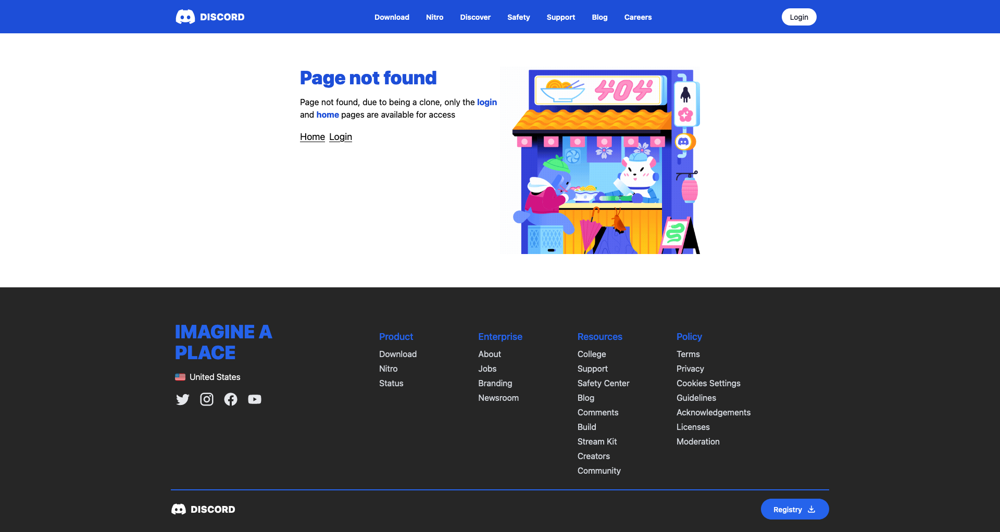

  <h1>Discord UI - Clone</h1>
   
  
This project was created with Nuxt and tailwind

 

  
If you want to see the website, 
    <a href='https://discord-clone-vue-nuxt-pxcd.vercel.app/' target='_blank'>click here</a>
  

  

  

   
  <h2>Pages</h2>
   
  
Three pages were created in this project, basically the main screen known as home,  the error screen that appears when trying to access an unrecognized page, and the login screen.

   

- <h3>HomePage</h3>
       
      
  

- <h3>Login</h3>
       
      
  

- <h3>Error page</h3>
       
      
  

